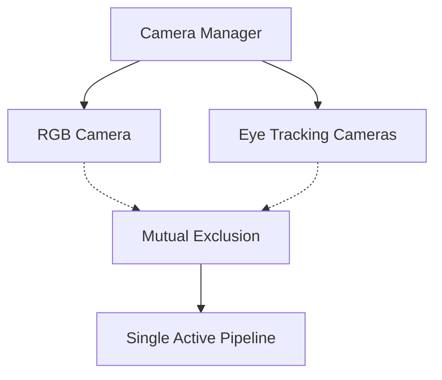

# Hardware Specifications

The Moon AR platform is built on custom hardware optimized for augmented reality applications with strict resource constraints.

## Core Hardware

| Component | Specification | Implications |
|-----------|---------------|--------------|
| **Processor** | Qualcomm SoC | Optimized for low-power AR workloads |
| **Memory** | 4GB LPDDR4 | Strict memory management required |
| **Storage** | 4GB eMMC | APK + assets must be ≤ 600MB |
| **OS** | Custom Android 9 | Modified launcher, system apps removed |

## Sensor Array

### Camera System



**Camera Components:**

- **RGB Camera**: Front-facing, computer vision tasks
- **Eye Tracking**: Dual near-infrared cameras
- **Exclusivity Rule**: Only one camera system active at a time

### Motion Sensors

- **6DoF IMU**: Head tracking and spatial orientation
- **Neural Wristband**: Hand gesture recognition
- **Capacitive Slider**: Direct touch input

## Performance Constraints

### Memory Management

```kotlin
// Example: Proper resource cleanup
override fun onPause() {
    super.onPause()
    camera?.release()    // Critical for camera switching
    System.gc()          // Encourage garbage collection
}
```

### Storage Optimization

- Use **Split APK** delivery for ARM64 only
- Compress textures to **ETC2** format
- Stream large assets rather than bundling

!!! warning "Hardware Limitations"
    The 4GB storage includes system files. Your application bundle should not exceed **600MB** total.

## Developer Testing Hardware

### Physical Device Required

The Moon AR device is essential for:

- Eye tracking integration testing
- Camera switching validation
- Gesture input verification
- Performance profiling

### Emulator Sufficient

Android 9 emulator works for:

- Business logic testing
- UI layout verification
- Plugin development
